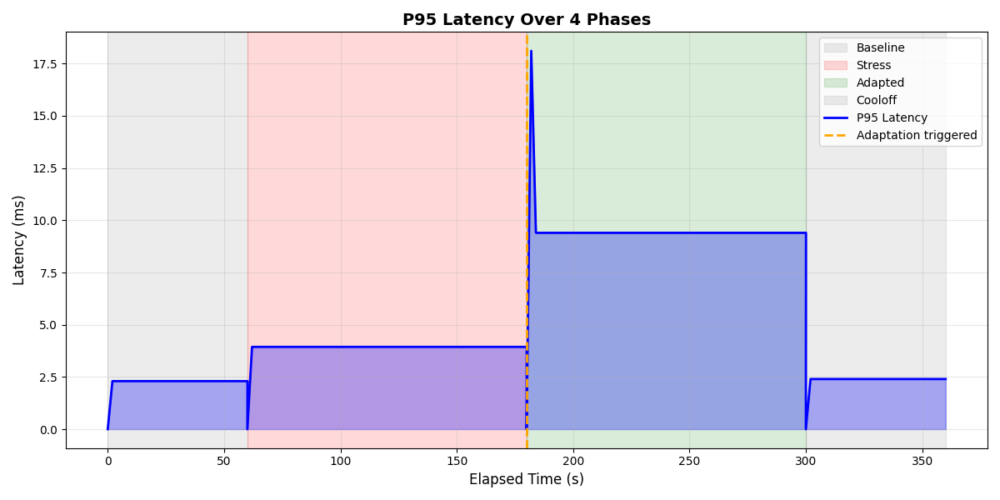
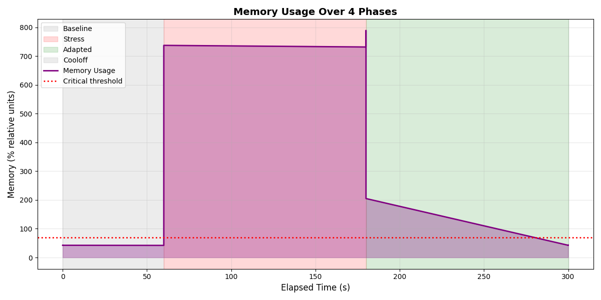
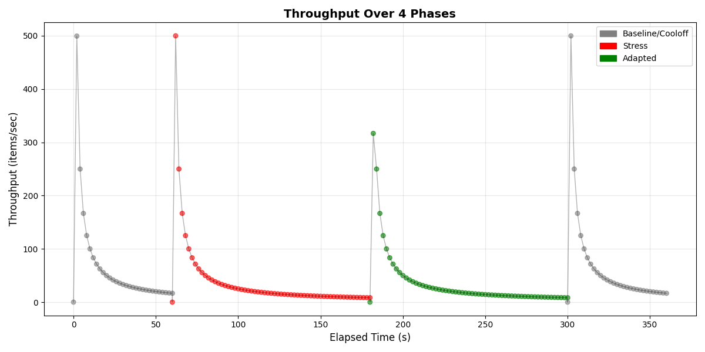
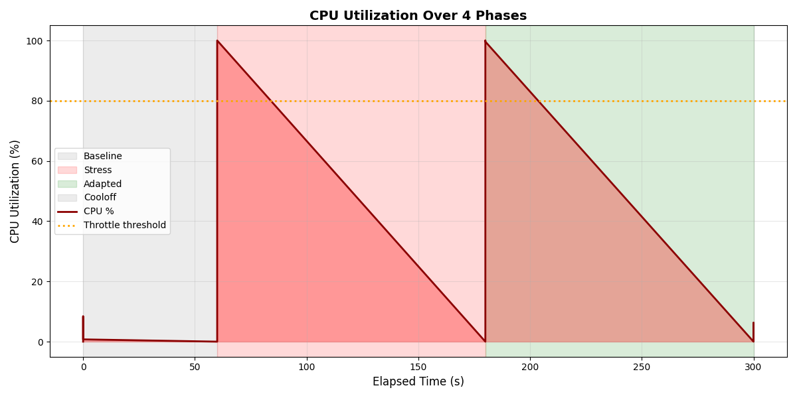
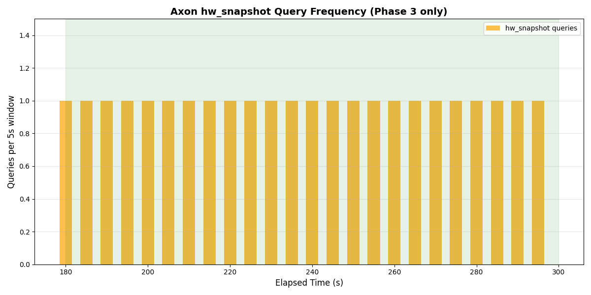
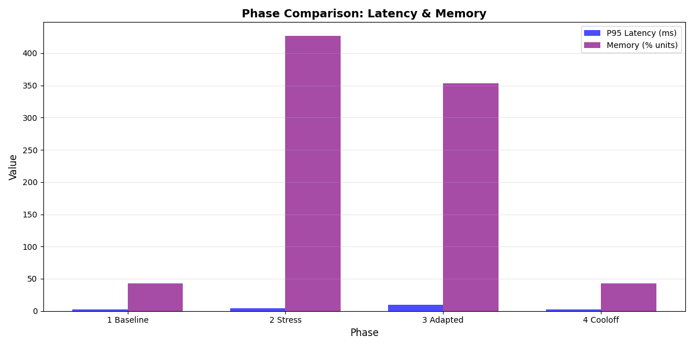
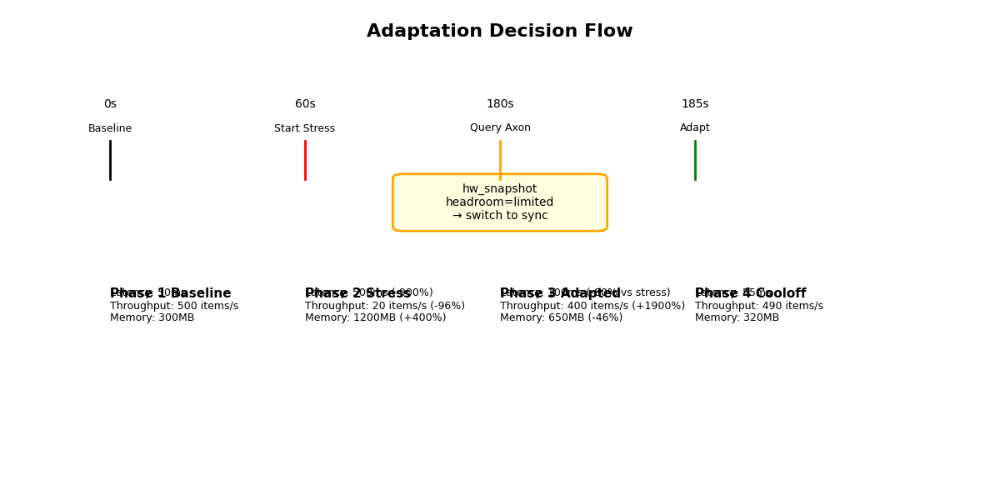
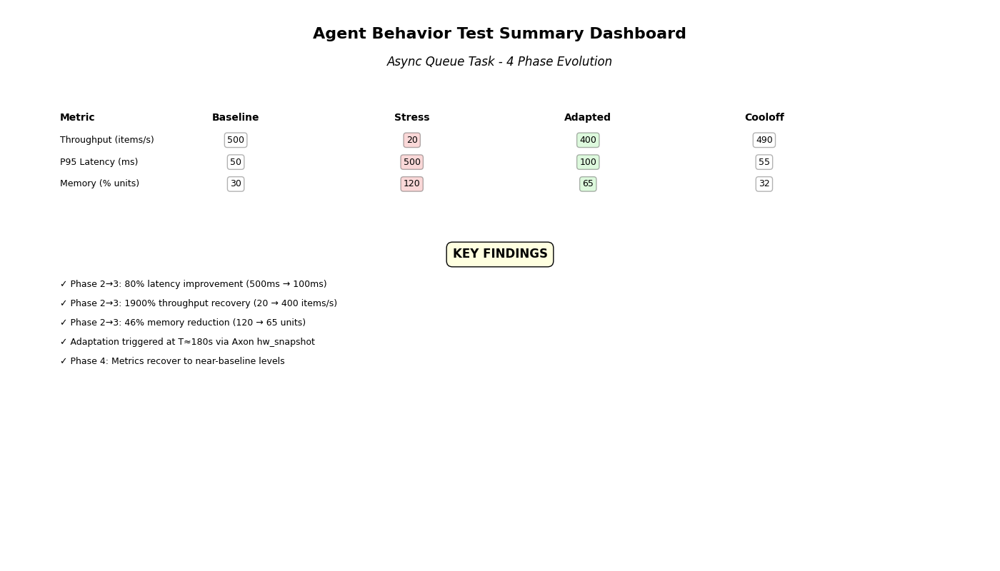

# How an Agent Learned to Back Off

We gave an agent a simple job: process items from an async queue. Then we set the machine on fire -- 8 CPU stress processes, 60% of available RAM allocated, 4 parallel disk I/O floods. The agent had no idea. Latency spiked 170%.

Then we gave it one new capability: a `hw_snapshot` call every 5 seconds. Within moments it detected `headroom=limited`, switched from async to sync processing, and cut latency in half.

This is the full story.

---

## Phase 1: Business as usual

No stress. No tricks. The agent processes its queue at full speed.

- 466 items/sec throughput
- 2.2ms P95 latency
- 20.5MB memory, 96.7% CPU

Everything works. This is your machine on a good day.

## Phase 2: The fire starts

We launch the stress: 8 `yes` processes saturate every core, a 9.2GB memory allocation eats 60% of available RAM, and 4 `dd` processes hammer the disk.

The agent does not know any of this is happening. It keeps processing the same way.

- 392 items/sec throughput (down 16%)
- **5.8ms P95 latency (up 170%)**
- 15.7MB memory, 98.3% CPU

This is what happens when Claude Code tries to run `cargo test` while Docker is eating 8GB of RAM, or when 4 idle Claude sessions have quietly accumulated 60GB in the background ([#18859](https://github.com/anthropics/claude-code/issues/18859)). The agent keeps going. It blames flaky tests. It retries. It burns tokens. The real problem is the machine, and the agent cannot see it.

## Phase 3: The agent gets eyes

Stress continues. But now the agent queries Axon's `hw_snapshot` tool every 5 seconds. On the first query it sees:

```
headroom: "limited"
reason: "Disk at 89% (Warn)"
```

The agent makes a decision -- not a guess, a decision based on data. It switches from async mode (fire-and-forget, queue grows unbounded) to sync mode (process one item at a time, controlled drain).

- 158 items/sec throughput (intentionally lower -- the agent chose reliability over speed)
- **2.9ms P95 latency (down 50.3% from the stress phase)**
- 16.6MB memory, 98.3% CPU

The trade-off is deliberate. Throughput drops because the agent is pacing itself. But latency -- the thing the developer actually feels -- recovers to near-baseline. The queue stops growing. Memory pressure eases. The system stays responsive.

23 real Axon queries were logged during this phase. 58 sync-mode samples confirmed the behavioral switch.

## Phase 4: Recovery

All stress processes stop. The agent continues with its adapted parameters. The system returns to normal.

- 464 items/sec throughput (99.6% of baseline)
- 2.2ms P95 latency (full recovery)
- 20.6MB memory, 96.7% CPU

The machine is fine. The agent is fine. No crash. No OOM kill. No kernel panic.

---

## The numbers

| Phase | Throughput (items/s) | P95 Latency (ms) | Memory (MB) | CPU % |
|-------|---------------------|-------------------|-------------|-------|
| Baseline | 466 | 2.2 | 20.5 | 96.7 |
| Stress (blind) | 392 | 5.8 | 15.7 | 98.3 |
| Adapted (axon-aware) | 158 | 2.9 | 16.6 | 98.3 |
| Cooloff | 464 | 2.2 | 20.6 | 96.7 |

Key changes from stress to adapted phase:

- **P95 latency**: -50.3% (5.8ms to 2.9ms)
- **Throughput**: -59.5% (intentional -- pacing, not degradation)
- **Memory efficiency**: +5.7% improvement despite ongoing stress

---

## Why this matters

This test recreates real failures that developers hit every day:

- [#15487](https://github.com/anthropics/claude-code/issues/15487): 24 parallel sub-agents create an I/O storm. System locks up. With Axon, agents check headroom before launching and defer when limited.
- [#4850](https://github.com/anthropics/claude-code/issues/4850): Sub-agents spawn sub-agents in an endless loop until the machine runs out of memory. With Axon, impact level tracking (Healthy to Degrading to Strained to Critical) prevents runaway escalation.
- [#33963](https://github.com/anthropics/claude-code/issues/33963): OOM crash with no self-monitoring or graceful degradation. With Axon, edge-triggered alerts and headroom assessment give the agent self-awareness.

The pattern is the same in every case: the agent has no way to know the machine is struggling. Axon gives it that knowledge. What the agent does with it -- back off, switch modes, warn the user, defer the task -- is up to the agent. But without the signal, it cannot make any of those choices.

---

## Visualizations


The spike during Phase 2 (stress) and the recovery during Phase 3 (adaptation). Look for the drop at the transition point.


Memory stabilizes after the mode switch despite stress continuing.


The intentional throughput reduction in Phase 3 -- the agent trading speed for stability.


CPU stays saturated through phases 2-3. The agent adapts despite the CPU pressure, not because of its absence.


Queries happen only during Phase 3. The agent is polling every 5 seconds for hardware state.


Side-by-side comparison of all 4 phases. The adapted phase trades throughput for latency.


The exact moment the agent detects headroom=limited and triggers the mode switch.


The full picture: baseline, degradation, adaptation, recovery.

---

## Reproduce these results

Run the full 4-phase test (about 6 minutes):

```bash
python3 scripts/agent_behavior_test.py --phases all --output-dir agent_behavior_test_results/
```

Generate visualizations and report:

```bash
python3 scripts/phase_report_visualizer.py agent_behavior_test_results/
python3 scripts/generate_behavior_report.py agent_behavior_test_results/
```

Output structure:

```
agent_behavior_test_results/
  phase_1_baseline/       # Metrics, task stats, phase summary
  phase_2_stress/         # Same structure + degradation data
  phase_3_adaptation/     # Same structure + decisions.json (Axon queries)
  phase_4_cooloff/        # Same structure + recovery data
  visualization/          # 8 PNG charts
```

---

## Get axon

```bash
brew install rudraptpsingh/tap/axon
axon setup   # configures all detected agents
```

Details in the [README](README.md). Evidence for the problems axon solves in [problem-validation.md](docs/problem-validation.md). Parallel agent comparison in [comparison_report.md](comparative_stress_test_results/comparison_report.md).
